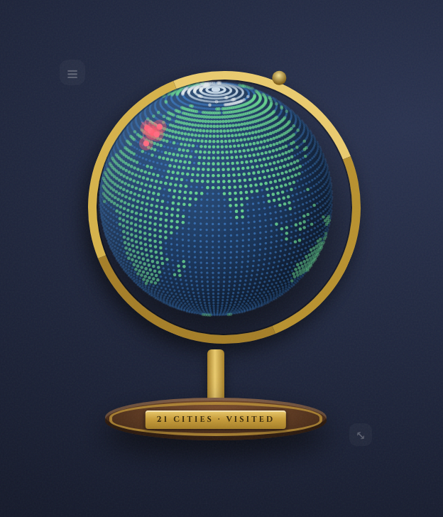
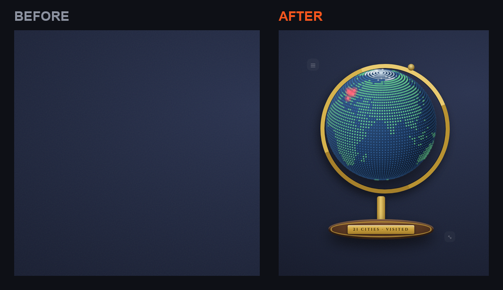

# spinning-globe

> A slowly spinning dot-matrix globe with arcs and a pin on every city you've visited.

[](https://github.com/jke48222/spinning-globe-widget/releases/latest) [](LICENSE) 

[Übersicht gallery](https://tracesof.net/uebersicht-widgets/) · [Widget suite](https://github.com/jke48222/widget-suite) · [Download](https://github.com/jke48222/spinning-globe-widget/releases/latest) · [Setup guide](docs/SETUP.md) · [Troubleshooting](docs/TROUBLESHOOTING.md)

A self-contained widget for [Übersicht](http://tracesof.net/uebersicht/). The
entire widget lives in `index.jsx` (the shared design system is inlined), so it
runs on any Mac with no extra files beyond the bundled assets.



A desk globe: a solid ocean sphere with the dot-matrix continents turning on it, a brass meridian ring, a brass stem, and a walnut base with a brass plate. Typeface: Cinzel. All fonts are under the SIL Open Font License; see `spinning-globe.widget/fonts/OFL.txt`.

## Before and after



### On the desktop

The widget running alongside the full set:


## Requirements

- macOS with [Übersicht](https://tracesof.net/uebersicht/) installed (`brew install --cask ubersicht`)

## Install

If you don't have Übersicht yet:

```sh
brew install --cask ubersicht
```

**One-click.** Clone the repo and run the installer. It copies the widget into Übersicht's widgets folder, installs any helper scripts, and runs setup if the widget needs it. Safe to re-run.

```sh
git clone https://github.com/jke48222/spinning-globe-widget.git
cd spinning-globe-widget && ./install.sh
```

**Manual.** Download `spinning-globe.widget.zip` from the [latest release](https://github.com/jke48222/spinning-globe-widget/releases/latest), unzip it, and put the `spinning-globe.widget` folder in `~/Library/Application Support/Übersicht/widgets/`. Then refresh Übersicht (menu bar icon → Refresh All).

Blank widget? See [docs/TROUBLESHOOTING.md](docs/TROUBLESHOOTING.md).

## Notes

- Fully offline; continents are baked into the widget.
- Click a pin to open it in Maps.
- Optional: install the Instrument Serif and Geist font families for the intended typography; system fonts are used as a fallback.

## Customization

Edit the CITIES array in index.jsx as [latitude, longitude] pairs.

All visual styling (colors, fonts, the card shell, drag/resize handles) is in
the inlined design-system block at the top of `index.jsx`.

## Bundled files

- `index.jsx`
- `install.sh` / `install.command` — one-click installer (copies the widget into Übersicht and installs any helpers)

## Related widgets

Part of the [Übersicht Widget Suite](https://github.com/jke48222/widget-suite): 16 widgets that share one design system.

- [Agent Fleet](https://github.com/jke48222/agent-fleet-widget)
- [Animated Wallpaper](https://github.com/jke48222/animated-wallpaper-widget)
- [Clipboard History](https://github.com/jke48222/clipboard-history-widget)
- [Daily AI Prompt](https://github.com/jke48222/daily-ai-prompt-widget)
- [Daily Astronomy Photo](https://github.com/jke48222/daily-astronomy-photo-widget)
- [Daily Tarot](https://github.com/jke48222/daily-tarot-widget)
- [GitHub Contributions](https://github.com/jke48222/github-contributions-widget)
- [Keys & Pads](https://github.com/jke48222/keys-and-pads-widget)
- [Now Playing](https://github.com/jke48222/now-playing-widget)
- [Pi Fleet](https://github.com/jke48222/pi-fleet-widget)
- [Recent Album Covers](https://github.com/jke48222/recent-album-covers-widget)
- [Recent Downloads](https://github.com/jke48222/recent-downloads-widget)
- [Rotating 3D Model](https://github.com/jke48222/rotating-3d-model-widget)
- [Wallpaper Switcher](https://github.com/jke48222/wallpaper-switcher-widget)
- [Window Pet](https://github.com/jke48222/window-pet-widget)

## License

MIT. See [LICENSE](LICENSE).

## Author

Jalen Edusei <jalen.edusei@gmail.com>
